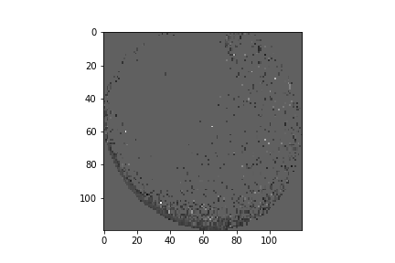
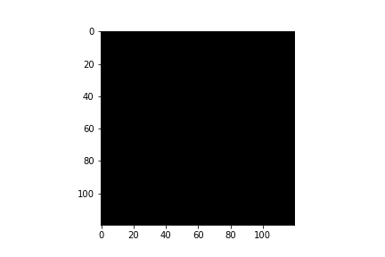

# Implement DeepInsight with Python

URL:https://www.nature.com/articles/s41598-019-47765-6

====================  
*Attention*  
So, My code is maybe miss...  
Sorry...  

====================  

## Test Data gene-expression
Analyze gene-expression

I test DeepInsight with using gene-expression Dataset.

### Dataset
Use Kaggle Dataset "gene-expression"
URL:https://www.kaggle.com/crawford/gene-expression


# Create Images from table Dataset

## Require Python Library
1. sys
2. math  
3. numpy
4. pandas
5. matplotlib
6. scipy
7. PIL
8. sklearn
9. imblearn
## How to Use(editing...)
```python
import DeepInsight

#table Dataset
deepinsight = DeepInsight.DeepInsigh()
train_image = deepinsight.fit(train_df, method='kpca')
train_image = deepinsight.fit_transform(train_df, method='kpca')
test_image = deepinsight.transform(test_df)
```

# Test
[sample](./test.ipynb)  

## kPCA



## t-SNE


